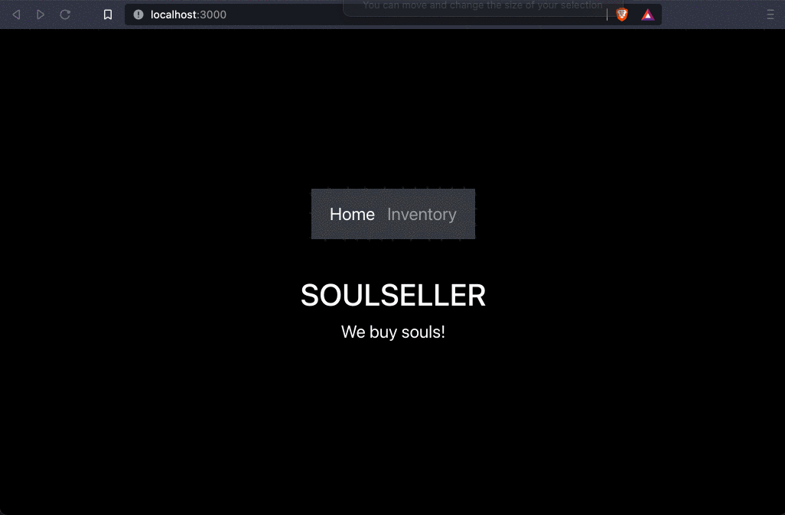

# SoleSeller

This is an application to connect multiselling platforms to provide comparison between seller fees and total earnings. 
As of now the application connects with Etsy and Ebay's functionality is withheld as we wait for them to fix their API. 

The handler.js contains most of the backend logic including all the etsy api calls.
Upon logging in to your etsy profile, we send you to the inventory, call the getEtsyInventoryFunction and sync that with the database.
The inventory displays any current items with prices as well as calculates seller fees. 

Frontend uses ES6 for react
Backend used NodeJS Express

A proxy server was created in order to use ebay callback properly. 
The proxy is currently commented out. To uncomment make the following changes as well as any requests that call for localhost:4000 need to be changed to http
*IF CONNECTING TO A SSL SERVER SEVERAL CHANGES NEED TO BE MADE TO THE 'index.js' FILE IN THE BACKEND, SEE COMMENTS FOR DETAILS. ALSO NEED TO SET UP THE PROXY IN THE FRONTEND 'package.json' FILE.*

when react is set up for frontend it uses 3000 port, for backend it needs to be routed differently so we use 4000. Ports can use any number.

- **npm run server** will run nodemon index.js using script found in package.json. (USE TO RUN BACKEND)
- **npm run start** will run front end using script found in package.json.(USE TO RUN FRONTEND)

## Video Walkthrough
Version 1.0:

Resources:

<!--https://www.youtube.com/watch?v=3isCTSUdXaQ>
